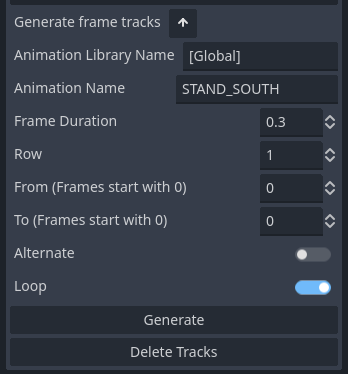

# GenerateAnimationPlayerFrameTracks Plugin for Godot

## Overview

The `GenerateAnimationPlayerFrameTracks` plugin is designed for the Godot Engine, specifically to enhance the `AnimationPlayer` for `Sprite2D` nodes. This plugin allows developers to efficiently generate animation tracks via an extended user interface, streamlining the animation process for `Sprite2D` nodes.

## Preview

## Features

-   Extended UI for AnimationPlayer: Improves the existing `AnimationPlayer` node with additional UI elements for ease of use.
-   Automatic Animation Track Generation: Facilitates the creation of animation tracks for `Sprite2D` nodes directly from the UI.
-   User-Friendly Design: Intuitive and accessible for developers of various skill levels.

## Prerequisites

-   Godot Engine: Compatible with Godot version 4.x or newer.
-   Sprite2D Node: The plugin is tailored for use with `Sprite2D` nodes.
-   AnimationPlayer Node: An `AnimationPlayer` node must be attached to the `Sprite2D` node.

## Installation

1.  Download the Plugin: Obtain the plugin from the designated download source.
2.  Project Setup: Place the downloaded plugin into the `addons` directory of your Godot project.
3.  Activate the Plugin: In Godot, go to `Project` -> `Project Settings` -> `Plugins`, and enable `GenerateAnimationPlayerFrameTracks`.

## Usage Instructions

1.  Setting Up Sprite2D:
	-   Add a `Sprite2D` node to your scene.
	-   Set up the texture for the `Sprite2D` node by selecting your desired image file.
2.  Attach AnimationPlayer:
	-   Ensure an `AnimationPlayer` node is attached to your `Sprite2D` node.
3.  Animation Setup:
	-   Define animations within the `AnimationPlayer`. This involves creating new animations and assigning the appropriate frames from the texture.
4.  Accessing Extended Features:
	-   With the `AnimationPlayer` selected, the extended UI elements provided by the plugin will be available.
5.  Generating Animation Tracks:
	-   Use the new UI options to create and manage animation tracks for your `Sprite2D` node.

## Support

For support, queries, or feedback regarding this plugin, please contact me ([contact@vincesanity.io](mailto:contact@vincesanity.io)) or visit https://www.vincesanity.io/about.
